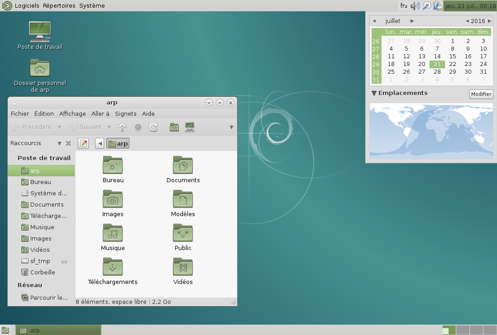
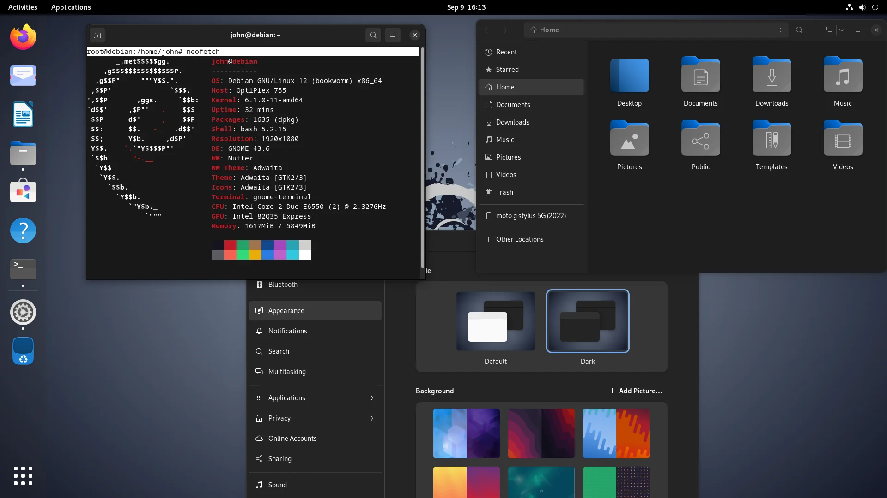
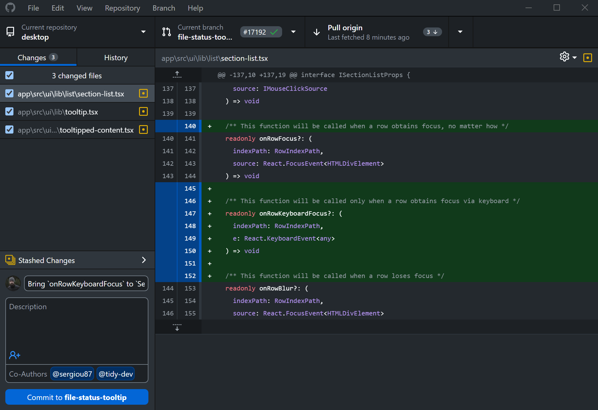

= Rapport SAE 2.03
Dewaele Enzo, Fernandes Bastien, Hamiti Edi. 2025
:toc:
:toc: left // A tester si ça fonctionne avec le PDF
:toc-title: Table des matières

== Installation automatisée de Debian

=== Introduction 

L’objectif de cette séance était d’automatiser complètement l’installation de Debian via un fichier de préconfiguration (`preseed.cfg`). Nous avons dû modifier ce fichier afin d’ajouter des fonctionnalités spécifiques, comme l’installation de l’environnement graphique MATE et de certains paquets, tout en configurant un utilisateur avec les droits sudo``.

=== Actions réalisées

Après avoir téléchargé et décompressé l'archive `autoinstall_Debian.zip` dans le répertoire de notre machine virtuelle, nous avons remplacé la chaine `@@UUID@@` présent dans le fichier `S203-Debian12.viso` avec la commande suivante :

[source,bash]
```
sed -i -E "s/(--iprt-iso-maker-file-marker-bourne-sh).*$/\1=$(cat
/proc/sys/kernel/random/uuid)/" S203-Debian12.viso
```

Afin de donner les droits sudo à l'utilisateur standard, installer l'environnement MATE et installer des paquets supplémentaires, nous avons modifié le fichier `preseed-fr.cfg` en ajoutant des lignes. Nous avons ajouté les lignes suivantes à notre `preseed-fr.cfg` pour ajouter les droits `sudo` à l'utilisateur standard, installer MATE et des paquets supplémentaires (sudo, git, sqlite3, curl, bash-completion, neofetch) :

[source,bash]
```
# Ajout de l'utilisateur dans le groupe sudo
d-i passwd/user-default-groups string audio cdrom video sudo

# Installation de MATE
tasksel tasksel/first multiselect standard ssh-server mate-desktop

# Installation des packages supplémentaires (sudo, git, sqlite3, curl, bash-completion, neofetch)
d-i pkgsel/include string sudo git sqlite3 curl bash-completion neofetch
```

== Questions semaine 1 

=== Questions 1 : Configuration matérielle dans VirtualBox

*Que signifie "64-bit" dans "Debian 64-bit" ?*

Dans "Debian 64-bit", "64-bit" fait référence à l'architecture du système d'exploitation. Cela signifie que le système est conçu pour fonctionner sur des processeurs 64 bits, capables de traiter plus de données simultanément que les processeurs 32 bits ^<<source-1,[1]>>^.

*Quelle est la configuration réseau utilisée par défaut ?*

Par défaut, VirtualBox utilise le mode de connexion réseau "NAT" (Network Address Translation). Dans ce mode, la machine virtuelle partage l'adresse IP de l'hôte et se connecte au réseau via celui-ci, permettant l'accès à Internet tout en restant inaccessible depuis l'extérieur ^<<source-2,[2]>>^.

*Quel est le nom du fichier XML contenant la configuration de votre machine ?*

Le fichier s'appelle `sae203.vbox` et se trouve dans le dossier de la machine virtuelle. Sur les machines TP, il se trouve dans :

----
/usr/local/virtual_machine/infoetu/{login}/vbox_vms/sae203/
----

où `+{login}+` est votre identifiant.

*Sauriez-vous modifier directement ce fichier de configuration pour mettre deux processeurs à votre machine ?*

[IMPORTANT]
.Éteignez la machine virtuelle avant de continuer.
Avant de modifier ce fichier, éteignez la machine virtuelle sinon, les modifications seront écrasées au prochain redémarrage.

Dans la section `<CPU>` de `sae203.vbox`, modifiez l'attribut `count` à 2 :

[source, xml]
----
<CPU count="2" hotplug="false"/>
----

'''
=== Questions 2. Installation de base

*Qu’est-ce qu’un fichier ISO bootable ?*

Un fichier ISO bootable est une image disque utilisée pour démarrer un ordinateur ou installer un système d'exploitation et/ou des logiciels ^<<source-3,[3]>>^.

.Exemple de fichier ISO
[caption="Figure 1 : "]
image::img/iso.png[Exemple de iso, width=15%]

*Qu’est-ce que MATE ? GNOME ?*

- MATE : Environnement de bureau léger et classique, dérivé de GNOME 2 ^<<source-4,[4]>>^.

[.text-center]
.Environment de Mate
[caption="Figure 2 : "]


- GNOME : Environnement de bureau moderne, minimaliste et axé sur la simplicité ^<<source-4,[4]>>^.

[.text-center]
.Environment de Gnome
[caption="Figure 3 : "]


*Qu’est-ce qu’un serveur web ?*

Un serveur web est un logiciel hébergeant des sites et applications web, accessibles via HTTP ^<<source-5,[5]>>^.

*Qu’est-ce qu’un serveur SSH ?*

Un serveur SSH permet un accès à distance sécurisé au système, grâce à un chiffrement des communications ^<<source-6,[6]>>^.

*Qu’est-ce qu’un serveur mandataire ?*

Un serveur mandataire (proxy) est un intermédiaire entre client et serveur, servant à filtrer et sécuriser les requêtes ^<<source-7,[7]>>^.

'''
=== Question(s) 3 : sudo

*Comment peut-on savoir à quels groupes appartient l’utilisateur "user" ?*

Utilisez la commande ^<<source-8,[8]>>^ :
[,bash]
----
groups "user"
----

'''
=== Questions 4.1 : Suppléments invités

*Quel est la version du noyau Linux utilisé par votre VM ? Justifiez votre réponse.*

Exécutez la commande:
[,bash]
----
uname -r
----
Ce qui donne par exemple `6.1.0-31-amd64`.

*À quoi servent les suppléments invités ? Donnez deux principales raisons de les installer.*

Ils améliorent les performances graphiques, le partage des dossiers et périphériques entre l'hôte et la VM (redimensionnement dynamique de la fenêtre, gestion du clipboard, etc) ^<<source-9,[9]>>^.

*À quoi sert la commande mount (dans notre cas et en général) ?*

La commande mount sert à monter un périphérique de stockage ou système de fichiers sur un répertoire spécifique. Ici, elle monte le CD des suppléments invités sur un répertoire du système.

'''
=== Questions 4.2 : Quelques Questions

*Qu’est-ce que le Projet Debian ? D’où vient le nom Debian ?*

Le Projet Debian est une organisation communautaire développant le système d’exploitation Debian, composé de logiciels libres. Le nom "Debian" provient de la combinaison du prénom de son fondateur, Ian Murdock, et de celui de sa compagne de l'époque, Debra Lynn ^<<source-10,[10]>>^.

*Quelles sont les durées de prise en charge (support) des versions Debian ? Pendant combien de temps les mises à jour de sécurité sont-elles assurées ?*

[%header, stripes=hover]
.Durées de prise en charge des versions Debian ^<<source-11,[11]>>^
|===
| Durée de support | Mises à jour de sécurité

| Durée minimale
| 1 an après la sortie de la version suivante

| Support long terme (LTS)
| 5 ans depuis la date de sortie initiale

| Support long terme étendu (ELTS)
| Jusqu'à 5 ans supplémentaires après le LTS, totalisant 10 ans
|===

*Combien de versions sont activement maintenues par Debian ? Quelles sont leurs dénominations génériques ?*

Debian maintient au moins trois versions :

. Stable : Version stable actuelle, recommandée.
. Testing : Future version stable en cours de test.
. Unstable : Version de développement avec les dernières mises à jour.

*D’où viennent les noms de code des distributions majeures Debian ?*

Les noms de code proviennent des personnages du film "Toy Story" de Pixar.

* Première version (Debian 1.1) : Nom de code Buzz, annoncée le 16 juin 1996.
* Dernière version (Debian 13) : Nom de code Trixie, annoncée le 12 août 2023.

'''
=== Question(s) 5. Ajustement de la pré-configuration

*Ajouter le droit d'utiliser sudo à l'utilisateur standard*

Dans le fichier `preseed-fr.cfg`, ajoutez :
[.text-center, source]
----
d-i passwd/user-default-groups string audio cdrom video sudo
----

*Installer l’environnement MATE*

Toujours dans `preseed-fr.cfg`, ajoutez :
[.text-center, source]
----
tasksel tasksel/first multiselect standard ssh-server mate-desktop
----

*Ajouter les paquets suivants : sudo, git, sqlite3, curl, bash-completion, neofetch*

Toujours dans `preseed-fr.cfg`, ajoutez :
[.text-center, source]
----
d-i pkgsel/include string sudo git sqlite3 curl bash-completion neofetch
----

== Questions semaine 3

//Mettre les réponses aux questions de la semaine 3
=== Question 1.Préliminaire

*Qu’est-ce que le logiciel gitk ? Comment se lance-t-il ?*

Gitk est une interface graphique pour visualiser l’historique des commits d’un dépôt Git. Il permet de visualiser les branches, les commits et les relations entre eux sous forme de graphes.

Pour l'ouvrir, il suffit de taper la commande `gitk` dans un terminal.

*Qu’est-ce que le logiciel git-gui ? Comment se lance-t-il ?*

Git-gui est une autre interface graphique pour Git, mais par rapport à gitk, elle permet de gérer les actions courantes de Git comme ajouter des fichiers, créer des commits, fusionner des branches, etc.

Pour l'ouvrir, il suffit de taper la commande `git gui` dans un terminal.

'''

=== Question 2.Comparons

*Pourquoi avez-vous choisi ce logiciel ?*

Nous avons choisi GitHub Desktop pour sa simplicité d'utilisation et sa gestion intuitive des dépôts Git. De plus, il est entièrement gratuit, contrairement à GitKraken qui, bien que plus complet, nécessite une licence payante pour certaines fonctionnalités, notamment l'utilisation avec des dépôts privés.

*Comment l’avez-vous installé ?*

Pour l'installer, il faut aller sur le github et simplement suivre ce qui est écrit
[.text-center]
----
https://gist.github.com/berkorbay/6feda478a00b0432d13f1fc0a50467f1
----

*Comparez-le aux outils inclus avec Git (installé précédemment) ainsi qu’avec ce qui serait fait en ligne de commande pure : fonctionnalités avantages, inconvénients...*

. **Gitk et Git-gui :** Gitk est principalement utilisé pour visualiser l'historique des commits de manière graphique. Il permet de naviguer dans les branches et les commits, mais reste assez basique dans son interface.
Git-gui, quant à lui, propose une interface pour effectuer les actions Git courantes comme le commit, le push, et la gestion des branches. Toutefois, il manque d'une gestion intuitive des conflits ou d'outils de visualisation avancée comme dans GitHub Desktop.
.. **Avantages :** Ces outils sont installés avec Git et n'ont pas de coûts supplémentaires. Git-gui reste un bon choix pour les actions de base.
.. **Inconvénients :** L'interface de Gitk et Git-gui peut être moins claire, en particulier pour les utilisateurs débutants.
Moins de fonctionnalités avancées et d'intégration avec des services comme GitHub.
. GitHub Desktop
:
[caption="Figure 4 : Interface de Github Desktop"]

.. **Avantages :** Interface très intuitive et facile à utiliser pour les débutants.
Intégration complète avec GitHub (bien que ce ne soit pas limité à GitHub, il fonctionne également avec des dépôts Git locaux).
Gestion des branches, commits, et push/pull très fluide.
Prise en charge des conflits de fusion de manière plus visuelle et conviviale.
Pas de nécessité d'utiliser la ligne de commande pour la plupart des opérations courantes.
.. **Inconvénients :** Moins de fonctionnalités avancées comparé à GitKraken (comme la gestion de projets plus complexes ou l’intégration avec plusieurs services).
Ne convient pas bien aux utilisateurs avancés qui préfèrent une ligne de commande complète et plus personnalisable.
. Ligne de commande pure :
.. **Avantages :**    
Offre une flexibilité totale et permet de réaliser toutes les opérations possibles avec Git.
L'utilisation de la ligne de commande permet une meilleure compréhension du fonctionnement interne de Git et est souvent plus rapide pour les utilisateurs expérimentés.
.. **Inconvénients :**
Peut être complexe et déroutante pour les débutants.
Prise en main difficile, surtout lorsqu'il s'agit de comprendre l'historique des commits ou de résoudre des conflits de manière visuelle.

En conclusion, GitHub Desktop offre une solution simple et accessible pour les utilisateurs qui privilégient une interface graphique sans les difficultés des lignes de commande ou des outils plus complexe comme GitKraken, même qu'il ne soit pas aussi complet que GitKraken.

[bibliography]
== Sources

// Le "+" à la fin de chaque ligne est là pour passer la ligne
// Le "*" au début de chaque ligne est là pour créer une liste non ordonnée (c'est comme ça dans la doc (https://docs.asciidoctor.org/asciidoc/latest/syntax-quick-reference/#bibliography))

// Pour rajouter des sources, rajoutez ça dans votre texte : ^<<source-x,[x]>>^


* [[source-1]][1] https://www.lemagit.fr/definition/64-bits[Que signifie 64-bits ?] +

* [[source-2]][2] https://www.it-connect.fr/comprendre-les-differents-types-de-reseaux-virtualbox/[Type de réseau virtualbox] +

* [[source-3]][3] https://www.ionos.fr/digitalguide/serveur/know-how/quest-ce-quun-fichier-iso/[Fichier ISO] +

* [[source-4]][4] https://fr.linuxadictos.com/diferencias-entre-gnome-mate-y-unity.html[Différence GNOME MATE Unity] +

* [[source-5]][5] https://www.hostinger.fr/tutoriels/serveur-web[Qu'est ce qu'un serveur web] +

* [[source-6]][6] https://fr.siteground.com/kb/quest-ce-que-ssh-et-comment-puis-je-lutiliser/[Utilisation SSH] +

* [[source-7]][7] https://www.techno-science.net/definition/3812.html[Serveur Mandataire] +

* [[source-8]][8] https://docs.redhat.com/fr/documentation/red_hat_enterprise_linux/9/html/configuring_basic_system_settings/listing-the-primary-and-supplementary-user-groups_editing-user-groups-using-the-command-line#listing-the-primary-and-supplementary-user-groups_editing-user-groups-using-the-command-line[Liste de groupes commande Linux] +

* [[source-9]][9] https://www.virtualbox.org/manual/ch04.html#guestadd-intro[Introduction to Guest Additions] +

* [[source-10]][10] https://www.debian.org/intro/about.fr.html[Debian.org] +

* [[source-11]][11] https://www.debian.org/releases/[Debian Releases]