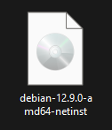
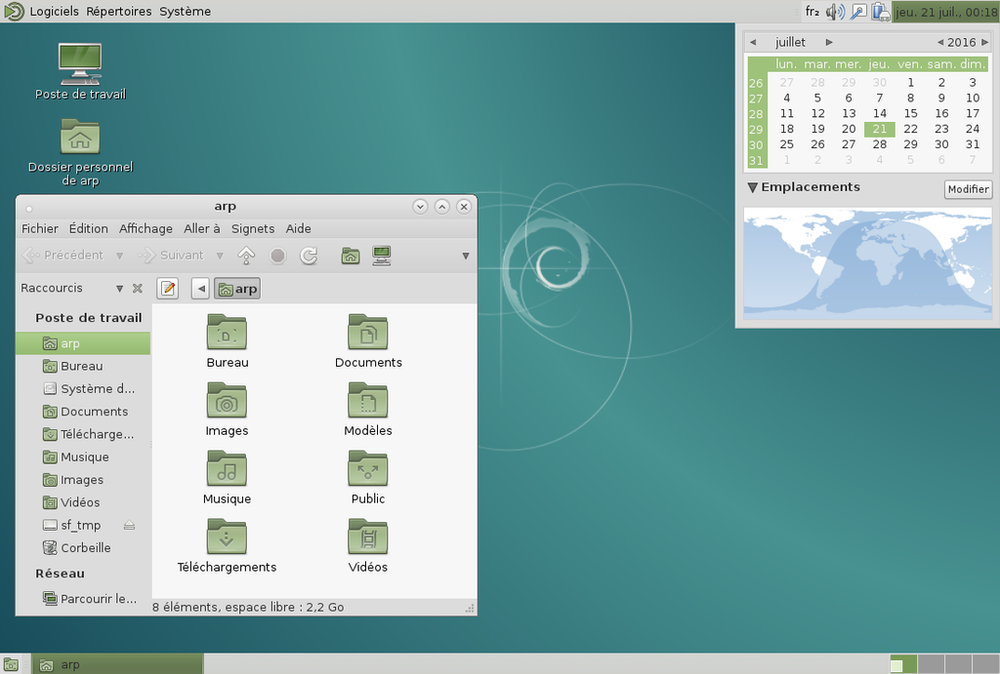
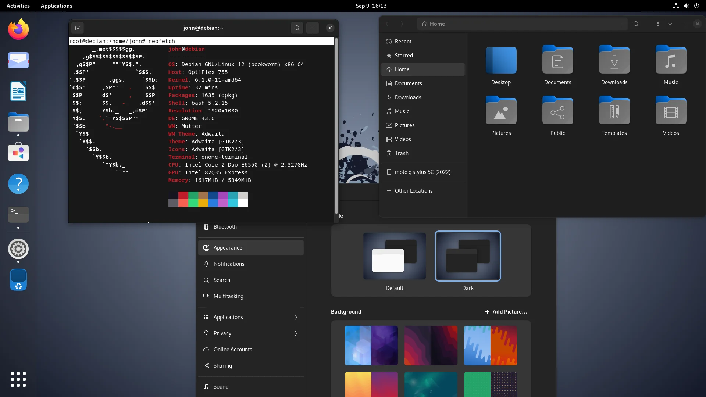

= Rapport SAÉ 2.03 - Installation de services réseaux
Dewaele Enzo, Fernandes Bastien, Hamiti Edi. 2025
:toc:
:toc-title: Table des matières
// Nous avons inclus un fichier CSS pour ajouter des coins arrondis aux images
:stylesheet: ./css/default.css
:icons: font

== Semaine 1 : Installation automatisée de Debian

=== Introduction

L’objectif de cette semaine (semaine 1) était d’automatiser complètement l’installation de Debian via un fichier de préconfiguration (`preseed.cfg`). Nous avons dû modifier ce fichier afin d’ajouter des fonctionnalités spécifiques, comme l’installation de l’environnement graphique MATE et de certains paquets, tout en configurant un utilisateur avec les droits `sudo`.

=== Actions réalisées

Après avoir téléchargé et décompressé l'archive `autoinstall_Debian.zip` dans le répertoire de notre machine virtuelle, nous avons remplacé la chaine `@@UUID@@` présent dans le fichier `S203-Debian12.viso` avec la commande suivante :

[source,bash]
----
sed -i -E "s/(--iprt-iso-maker-file-marker-bourne-sh).*$/\1=$(cat/proc/sys/kernel/random/uuid)/" S203-Debian12.viso
----

Afin de donner les droits sudo à l'utilisateur standard, installer l'environnement MATE et installer des paquets supplémentaires, nous avons modifié le fichier `preseed-fr.cfg` en ajoutant des lignes. Nous avons ajouté les lignes suivantes pour ajouter les droits `sudo` à l'utilisateur standard, installer MATE et des paquets supplémentaires (`sudo`, `git`, `sqlite3`, `curl`, `bash-completion`, `neofetch`) :

[[preseed]]
[source,bash]
----
# Ajout de l'utilisateur dans le groupe sudo
d-i passwd/user-default-groups string audio cdrom video sudo

# Installation de MATE
tasksel tasksel/first multiselect standard ssh-server mate-desktop

# Installation des packages supplémentaires (sudo, git, sqlite3, curl, bash-completion, neofetch)
d-i pkgsel/include string sudo git sqlite3 curl bash-completion neofetch
----

Pour l'installation des packages supplémentaires, nous avons d'abord tenté d'utiliser la commande suivante dans le fichier `preseed-fr.cfg` :

[source, bash]
----
d-i preseed/late_command string in-target sh -c "apt-get update && apt-get dist-upgrade -y && apt-get install -y sudo git sqlite3 curl bash-completion neofetch"
----

Cette solution n'ayant pas donné les résultats escomptés, nous avons finalement choisi d'utiliser <<preseed,la commande présente plus haut.>>

=== Questions

==== Questions 1 : Configuration matérielle dans VirtualBox

*Que signifie "64-bit" dans "Debian 64-bit" ?*

Dans "Debian 64-bit", "64-bit" fait référence à l'architecture du système d'exploitation. Cela signifie que le système est conçu pour fonctionner sur des processeurs 64 bits, capables de traiter plus de données simultanément que les processeurs 32 bits ^<<source-1,[1]>>^.

*Quelle est la configuration réseau utilisée par défaut ?*

Par défaut, VirtualBox utilise le mode de connexion réseau "NAT" (Network Address Translation). Dans ce mode, la machine virtuelle partage l'adresse IP de l'hôte et se connecte au réseau via celui-ci, permettant l'accès à Internet tout en restant inaccessible depuis l'extérieur ^<<source-2,[2]>>^.

*Quel est le nom du fichier XML contenant la configuration de votre machine ?*

Le fichier s'appelle `sae203.vbox` et se trouve dans le dossier de la machine virtuelle. Sur les machines TP, il se trouve dans :

----
/usr/local/virtual_machine/infoetu/{login}/vbox_vms/sae203/
----

où `+{login}+` est votre identifiant.

*Sauriez-vous modifier directement ce fichier de configuration pour mettre deux processeurs à votre machine ?*

[IMPORTANT]
.Éteignez la machine virtuelle avant de continuer.
Avant de modifier ce fichier, éteignez la machine virtuelle sinon, les modifications seront écrasées au prochain redémarrage.

Dans la section `<CPU>` de `sae203.vbox`, modifiez l'attribut `count` à 2 :

[source, xml]
----
<CPU count="2" hotplug="false"/>
----

'''
==== Questions 2. Installation de base

*Qu’est-ce qu’un fichier ISO bootable ?*

Un fichier ISO bootable est une image disque utilisée pour démarrer un ordinateur ou installer un système d'exploitation et/ou des logiciels ^<<source-3,[3]>>^.

[.text-center]
.Exemple de fichier ISO
[caption="Figure 1 : "]

*Qu’est-ce que MATE ? GNOME ?*

- MATE : Un environnement de bureau basé sur l'ancienne version de GNOME 2. Il a été créé pour les utilisateurs qui préféraient l'interface de GNOME 2 après la transition de GNOME 3 vers une interface plus moderne^<<source-4,[4]>>^.

[.text-center]
.Environment de Mate
[caption="Figure 2 : "]

- GNOME : GNOME est un environnement de bureau largement utilisé sur les distributions Linux ^<<source-4,[4]>>^.

[.text-center]
.Environment de Gnome
[caption="Figure 3 : "]

*Qu’est-ce qu’un serveur web ?*

Un serveur web est un logiciel hébergeant des sites et applications web, accessibles via HTTP ^<<source-5,[5]>>^.

*Qu’est-ce qu’un serveur SSH ?*

Un serveur SSH permet un accès à distance sécurisé au système, grâce à un chiffrement des communications ^<<source-6,[6]>>^.

*Qu’est-ce qu’un serveur mandataire ?*

Un serveur mandataire (proxy) est un intermédiaire entre client et serveur, servant à filtrer et sécuriser les requêtes ^<<source-7,[7]>>^.

'''
==== Question(s) 3 : sudo

*Comment peut-on savoir à quels groupes appartient l’utilisateur "user" ?*

Utilisez la commande ^<<source-8,[8]>>^ :
[,bash]
----
groups "user"
----

'''
==== Questions 4.1 : Suppléments invités

*Quel est la version du noyau Linux utilisé par votre VM ? Justifiez votre réponse.*

Exécutez la commande:
[,bash]
----
uname -r
----
Ce qui donne par exemple `6.1.0-31-amd64`.

*À quoi servent les suppléments invités ? Donnez deux principales raisons de les installer.*

Ils améliorent les performances graphiques, le partage des dossiers et périphériques entre l'hôte et la VM (redimensionnement dynamique de la fenêtre, gestion du clipboard, etc) ^<<source-9,[9]>>^.

*À quoi sert la commande mount (dans notre cas et en général) ?*

La commande mount sert à monter un périphérique de stockage ou système de fichiers sur un répertoire spécifique. Ici, elle monte le CD des suppléments invités sur un répertoire du système.

'''
==== Questions 4.2 : Quelques Questions

*Qu’est-ce que le Projet Debian ? D’où vient le nom Debian ?*

Le Projet Debian est une organisation communautaire développant le système d’exploitation Debian, composé de logiciels libres. Le nom "Debian" provient de la combinaison du prénom de son fondateur, Ian Murdock, et de celui de sa compagne de l'époque, Debra Lynn ^<<source-10,[10]>>^.

*Quelles sont les durées de prise en charge (support) des versions Debian ? Pendant combien de temps les mises à jour de sécurité sont-elles assurées ?*

[%header, stripes=hover]
.Durées de prise en charge des versions Debian ^<<source-11,[11]>>^
|===
| Durée de support | Mises à jour de sécurité

| Durée minimale
| 1 an après la sortie de la version suivante

| Support long terme (LTS)
| 5 ans depuis la date de sortie initiale

| Support long terme étendu (ELTS)
| Jusqu'à 5 ans supplémentaires après le LTS, totalisant 10 ans
|===

*Combien de versions sont activement maintenues par Debian ? Quelles sont leurs dénominations génériques ?*

Debian maintient au moins trois versions :

. Stable : Version stable actuelle, recommandée.
. Testing : Future version stable en cours de test.
. Unstable : Version de développement avec les dernières mises à jour.

*D’où viennent les noms de code des distributions majeures Debian ?*

Les noms de code proviennent des personnages du film "Toy Story" de Pixar.

* Première version (Debian 1.1) : Nom de code Buzz, annoncée le 16 juin 1996.
* Dernière version (Debian 13) : Nom de code Trixie, annoncée le 12 août 2023.

'''
==== Question(s) 5. Ajustement de la pré-configuration

*Ajouter le droit d'utiliser sudo à l'utilisateur standard*

Dans le fichier `preseed-fr.cfg`, ajoutez :
[.text-center, source]
----
d-i passwd/user-default-groups string audio cdrom video sudo
----

*Installer l’environnement MATE*

Toujours dans `preseed-fr.cfg`, ajoutez :
[.text-center, source]
----
tasksel tasksel/first multiselect standard ssh-server mate-desktop
----

*Ajouter les paquets suivants : sudo, git, sqlite3, curl, bash-completion, neofetch*

Toujours dans `preseed-fr.cfg`, ajoutez :
[.text-center, source]
----
d-i pkgsel/include string sudo git sqlite3 curl bash-completion neofetch
----

== Semaine 2 : Format texte à balisage léger

L'objectif de cette semaine (semaine 2) était de se familiariser avec des formats de texte à balisage léger, en particuler Markdown et AsciiDoctor. Nous avons également appris à utiliser des outils de conversion pour transformer ces formats en HTML et PDF.

Nous avons finalement utilisé AsciiDoctor pour rédiger ce rapport, car il offre une syntaxe plus riche et structurée, mieux adaptée à la rédaction de documents techniques. Il permet une meilleure hiérarchisation des sections, une gestion avancée des éléments (notes, tableaux, références), et un export multi-formats de qualité (HTML, PDF, DocBook). Même si ce choix n’était pas motivé par une contrainte précise au départ, Asciidoctor s’avère plus adapté à un rapport structuré et professionnel.

== Semaine 3 : Étude applications clientes

=== Introduction

L'objectif de cette semaine (semaine 3) était d'étudier les applications clientes Git Nous avons comparé ces outils avec les outils inclus avec Git, tels que gitk et git-gui.

=== Actions réalisées

Nous avons installé et testé plusieurs applications clientes Git, notamment GitHub Desktop et GitKraken. Nous avons comparé leurs fonctionnalités, avantages et inconvénients par rapport aux outils de base de Git.

=== Questions

==== Question 1.Préliminaire

*Qu’est-ce que le logiciel gitk ? Comment se lance-t-il ?*

Gitk est une interface graphique pour visualiser l’historique des commits d’un dépôt Git. Il permet de visualiser les branches, les commits et les relations entre eux sous forme de graphes.

Pour l'ouvrir, il suffit de taper la commande `gitk` dans un terminal.

*Qu’est-ce que le logiciel git-gui ? Comment se lance-t-il ?*

Git-gui est une autre interface graphique pour Git, mais par rapport à gitk, elle permet de gérer les actions courantes de Git comme ajouter des fichiers, créer des commits, fusionner des branches, etc.

Pour l'ouvrir, il suffit de taper la commande `git gui` dans un terminal.

'''

==== Question 2.Comparons

*Pourquoi avez-vous choisi ce logiciel ?*

Nous avons choisi GitHub Desktop pour sa simplicité d'utilisation et sa gestion intuitive des dépôts Git. De plus, il est entièrement gratuit, contrairement à GitKraken qui, bien que plus complet, nécessite une licence payante pour certaines fonctionnalités, notamment l'utilisation avec des dépôts privés.

*Comment l’avez-vous installé ?*

[notoc]
===== Installation sous **Windows** ou **MacOS** :

Il existe un installateur pour GitHub Desktop, disponible sur le site officiel de GitHub. Il suffit de télécharger l'installateur et de suivre les instructions pour l'installation sur une machine tournant sous Windows ou MacOS. Cet installateur est https://github.com/apps/desktop[disponible ici]

[notoc]
===== Installation sur **Linux** :

Même si GitHub Desktop n'est pas officiellement supporté sur Linux, il existe des versions portées sur Linux par la communauté. Une de ces versions est maintenue par Brendan Forster, un membre de Github et est disponible sur son dépot Github.
Des instructions d'installations sont disponibles sur ce dépot :

[.text-center]
----
https://github.com/shiftkey/desktop
----

*Comparez-le aux outils inclus avec Git (installé précédemment) ainsi qu’avec ce qui serait fait en ligne de commande pure : fonctionnalités avantages, inconvénients...*

. **Gitk et Git-gui :** Gitk est principalement utilisé pour visualiser l'historique des commits de manière graphique. Il permet de naviguer dans les branches et les commits, mais reste assez basique dans son interface.
Git-gui, quant à lui, propose une interface pour effectuer les actions Git courantes comme le commit, le push, et la gestion des branches. Toutefois, il manque d'une gestion intuitive des conflits ou d'outils de visualisation avancée comme dans GitHub Desktop.
.. **Avantages :** Ces outils sont installés avec Git et n'ont pas de coûts supplémentaires. Git-gui reste un bon choix pour les actions de base.
.. **Inconvénients :** L'interface de Gitk et Git-gui peut être moins claire, en particulier pour les utilisateurs débutants.
Moins de fonctionnalités avancées et d'intégration avec des services comme GitHub.
. GitHub Desktop 
:
[caption="Figure 4 : "]
image::img/screenshot-interface-github-desktop.png[Exemple de l'interface de Mate, width=75%, border-radius=20px, align=center]
.. **Avantages :** Interface très intuitive et facile à utiliser pour les débutants.
Intégration complète avec GitHub (bien que ce ne soit pas limité à GitHub, il fonctionne également avec des dépôts Git locaux, Gitlab, BitBucket, etc...).+
Gestion des branches, commits, et push/pull très fluide.
Prise en charge des conflits de fusion de manière plus visuelle et conviviale.
Pas de nécessité d'utiliser la ligne de commande pour la plupart des opérations courantes.
.. **Inconvénients :** Moins de fonctionnalités avancées comparées à GitKraken (comme la gestion de projets plus complexes ou l’intégration avec plusieurs services).
Ne convient pas bien aux utilisateurs avancés qui préfèrent une ligne de commande complète et plus personnalisable.
. Ligne de commande pure :
.. **Avantages :**    
Offre une flexibilité totale et permet de réaliser toutes les opérations possibles avec Git.
L'utilisation de la ligne de commande permet une meilleure compréhension du fonctionnement interne de Git et est souvent plus rapide pour les utilisateurs expérimentés.
.. **Inconvénients :**
Peut être complexe et déroutante pour les débutants.
Prise en main difficile, surtout lorsqu'il s'agit de comprendre l'historique des commits ou de résoudre des conflits de manière visuelle.

En conclusion, GitHub Desktop offre une solution simple et accessible pour les utilisateurs qui privilégient une interface graphique sans les difficultés des lignes de commande ou des outils plus complexe comme GitKraken, même qu'il ne soit pas aussi complet que GitKraken.

// FIN DE LA SEMAINE 1

== Semaine 4 : Installation du service *Gitea*

=== Introduction

L'objectif de cette semaine (semaine 4) était d'installer et de configurer Gitea, une plateforme Git auto-hébergée. Nous avons également exploré ses fonctionnalités, notamment la création d'utilisateurs et de projets.

=== Actions réalisées

Nous avons installé Gitea sur une machine virtuelle Debian 12, en suivant les instructions de la documentation officielle. Nous avons configuré le service pour qu'il fonctionne avec une base de données SQLite3, et nous avons créé un utilisateur administrateur pour gérer la plateforme.

=== Problèmes rencontrés durant l'installation

Durant l'installation de Gitea sur les machines virtuelles, nous avons rencontré une erreur avec les permissions du dossier `/etc/gitea`, qui ne permetter pas l'initialisation du fichier `app.ini`

=== Tests d'utilisation

==== Créations d'utilisateurs

Avant de créer des projets, on peut créer différents utilisateurs. Il y a plusieurs moyens de créer des utilisateurs sur Gitea :

[notoc]
===== En tant qu'administrateur

En tant qu'administrateur, il est possible d'aller dans la page d'administration du site et ensuite accéder à la page "User accounts" pour créer un utilisateurs

.Tutoriel pour accéder à la page de création d'utilisateur
video::video/admin_creation_user.mp4[]

[notoc]
===== En tant qu'utilisateur standard

Nous pouvons aussi créer des utilisateurs sans être administrateur. Pour cela, il faut se rendre sur la page d'accueil de Gitea et cliquer sur le bouton "Sign up" en haut à droite de l'écran. Il suffit ensuite de remplir les informations demandées pour créer un compte.

.Tutoriel sur la création de comptes sans accès administrateur
video::video/standard_creation_user.mp4[]

==== Création de projets

> Réalisez l'ajout d'un projet directement créé depuis l’interface web de Gitea

Pour créer un projet directement en utilisant l'interface web de Gitea, nous avons cliqué sur le bouton "+" situé en haut à droite de l'interface puis sur "New repository". Nous avons ensuite rempli les informations nécessaires pour la création du projet.

=== Questions

==== Question(s) 1. À propos de Gitea

*Qu’est-ce que Gitea ?*

Gitea est une plateforme de code source qui permet de créer, gérer et partager des dépôts Git via une interface web. C'est une alternative plus légère à des solutions comme Github ou Gitlab, permettant de s'auto-héberger et de gérer leurs propres dépôts sans dépendre d'une solution cloud

*Gitea peut être comparé à des logiciels comme (en citer au moins 2) ?*

. GitHub : Une plateforme populaire de gestion de code source basée sur Git, offrant des services comme la gestion de projets, des wikis, des discussions et plus encore.
. GitLab : Une autre plateforme similaire à GitHub, mais qui inclut aussi des fonctionnalités d'intégration continue (CI), de livraison continue (CD) et de gestion de pipelines DevOps.

*Qu’est-ce qu’un fork (dans le domaine du développement logiciel bien entendu) ?*

Un "fork" est une copie indépendante d'un projet existant. Dans le contexte des plateformes comme GitHub, un fork permet à un utilisateur de prendre un projet open-source, d'y apporter ses propres modifications sans affecter le projet original, et de soumettre ensuite ses changements sous forme de "pull requests" si nécessaire.

*De quel logiciel Gitea est-il le fork ? Ce logiciel existe-t-il encore ?*

Gitea est un fork du logiciel Gogs, une autre plateforme de gestion de dépôts Git. Gogs existe toujours, bien qu'il soit moins actif que Gitea, qui a connu une adoption plus large et une communauté plus dynamique.

==== Question(s) 2. Mise à jour

*Donnez la version que vous avez installé et la commande permettant d’obtenir cette information.*

Pour obtenir la version de Gitea installée, on utilise la commande suivante :
[source, bash]
----
gitea --version
----

Nous avons la version 1.23.5 de Gitea.

*Comment faire pour mettre à jour le binaire de votre service sans devoir tout reconfigurer ?*

Pour mettre à jour le binaire de Gitea sans reconfigurer tout le système, il suffit de télécharger la dernière version stable du binaire et de remplacer l'exécutable actuel par le nouveau, comme expliqué précédemment. Cette méthode permet de conserver toutes les configurations existantes, y compris les paramètres de base de données et les utilisateurs.

// Remplir avec des nouvelles sources
<<<
[bibliography]
== Sources

* [[source-1]][1] https://www.lemagit.fr/definition/64-bits[Que signifie 64-bits ?] +

* [[source-2]][2] https://www.it-connect.fr/comprendre-les-differents-types-de-reseaux-virtualbox/[Type de réseau virtualbox] +

* [[source-3]][3] https://www.ionos.fr/digitalguide/serveur/know-how/quest-ce-quun-fichier-iso/[Fichier ISO] +

* [[source-4]][4] https://fr.linuxadictos.com/diferencias-entre-gnome-mate-y-unity.html[Différence GNOME MATE Unity] +

* [[source-5]][5] https://www.hostinger.fr/tutoriels/serveur-web[Qu'est-ce qu'un serveur web] +

* [[source-6]][6] https://fr.siteground.com/kb/quest-ce-que-ssh-et-comment-puis-je-lutiliser/[Utilisation SSH] +

* [[source-7]][7] https://www.techno-science.net/definition/3812.html[Serveur Mandataire] +

* [[source-8]][8] https://docs.redhat.com/fr/documentation/red_hat_enterprise_linux/9/html/configuring_basic_system_settings/listing-the-primary-and-supplementary-user-groups_editing-user-groups-using-the-command-line#listing-the-primary-and-supplementary-user-groups_editing-user-groups-using-the-command-line[Liste de groupes commande Linux] +

* [[source-9]][9] https://www.virtualbox.org/manual/ch04.html#guestadd-intro[Introduction to Guest Additions] +

* [[source-10]][10] https://www.debian.org/intro/about.fr.html[Debian.org] +

* [[source-11]][11] https://www.debian.org/releases/[Debian Releases]
